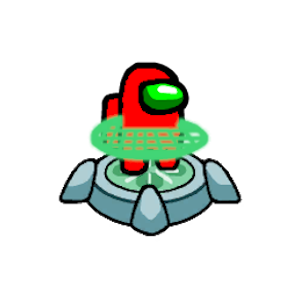

# MedbayTech
A complete hospital management system made as a class project  
for Software Design  
<p align="center">
    
</p> 

## Usage
To start a project, run the required microservices

### Pharmacy Integration
- MedbayTech.Tenders
- MedbayTech.Medications
- MedbayTech.Pharmacies
- MedbayTech.PatientDocuments
- MedbayTech.Users  
**Frontend**  
``` bash
    # From MedbayTech.PharmacyUI/ run:
    npm install -g @vue/cli
    npm install --save axios vue-axios
    npm install
    npm run serve
```
### Patient Web app
- MedbayTech.APIGateways
- MedbayTech.Appointment
- MedbayTech.Feedback
- MedbayTech.PatientDocuments
- MedbayTech.Pharmacies
- MedbayTech.Rooms
- MedbayTech.Users  
**Frontend**  
``` bash
    # From WebApplicationFrontend/ run:
    npm install
    ng serve --o
```

### Graphic Editor
- MedbayTech.Appointment
- MedbayTech.Rooms
- MedbayTech.Medications
- MedbayTech.Users  
**Frontend**  
From MedbayTech.GraphicEditor copy Icons/ and View/ folder to bin/netcoreapp3.1/  
and then run the WPF app


##  Start our projects:
####  Graphic Editor:
<li>Copy folders Icons and MapData to bin/Debug/netcoreapp3.1</li>
<li>Add new migration and update database if needed</li>
<li>Start new instance of GraphicEditorWebService from Visual Studio</li>
<li>Then start new instance of GraphicEditor</li>

####  Web Application:
<li>Add new migration and update database if needed</li>
<li>Start new instance of WebApplication from Visual Studio</li>
<li>Go to project WebApplicationFrontend and in your command line type</li>

```sh
npm install 
```
```sh
ng serve --o
```

####  Pharmacy Integration:
<li>Add new migration and update database if needed</li>
<li>Start new instance of PharmacyIntegration from Visual Studio</li>


## MedbayTech team
|         *DevOps*        | *Hospital editor*  | *Pharmacy integration* | *Web app*      |
|:-----------------------:|--------------------|------------------------|----------------|
| Ignjatijević Aleksandar | Jakovljević Jovana | Farkaš Kristian        | Ivić Mihailo   |
| Vlajkov Jelena          | Tamindžija Nemanja | Župunski Radovan       | Čivčić Ognjen  |
| Arađanin Stefan         | Antonić Nikola     | Pekez Marko            | Vujić Bojan    |
| Vojvodić Danica         | Pjevalica Bojana   | Ivošević Jovan         | Marković Filip | 

## Emoji guideline
It is recommended to use emoji's where adequate when commiting  

See also [gitmoji](https://gitmoji.carloscuesta.me/).

|   Commit type              | Emoji                                         |
|:---------------------------|:----------------------------------------------|
| Initial commit             | :tada: `:tada:`                               |
| Version tag                | :bookmark: `:bookmark:`                       |
| New feature                | :sparkles: `:sparkles:`                       |
| Bugfix                     | :bug: `:bug:`                                 |
| Metadata                   | :card_index: `:card_index:`                   |
| Documentation              | :books: `:books:`                             |
| Documenting source code    | :bulb: `:bulb:`                               |
| Performance                | :racehorse: `:racehorse:`                     |
| Cosmetic                   | :lipstick: `:lipstick:`                       |
| Tests                      | :rotating_light: `:rotating_light:`           |
| Adding a test              | :white_check_mark: `:white_check_mark:`       |
| Make a test pass           | :heavy_check_mark: `:heavy_check_mark:`       |
| General update             | :zap: `:zap:`                                 |
| Improve format/structure   | :art: `:art:`                                 |
| Refactor code              | :hammer: `:hammer:`                           |
| Removing code/files        | :fire: `:fire:`                               |
| Continuous Integration     | :green_heart: `:green_heart:`                 |
| Security                   | :lock: `:lock:`                               |
| Upgrading dependencies     | :arrow_up: `:arrow_up:`                       |
| Downgrading dependencies   | :arrow_down: `:arrow_down:`                   |
| Lint                       | :shirt: `:shirt:`                             |
| Translation                | :alien: `:alien:`                             |
| Text                       | :pencil: `:pencil:`                           |
| Critical hotfix            | :ambulance: `:ambulance:`                     |
| Deploying stuff            | :rocket: `:rocket:`                           |
| Fixing on MacOS            | :apple: `:apple:`                             |
| Fixing on Linux            | :penguin: `:penguin:`                         |
| Fixing on Windows          | :checkered_flag: `:checkered_flag:`           |
| Work in progress           | :construction:  `:construction:`              |
| Adding CI build system     | :construction_worker: `:construction_worker:` |
| Analytics or tracking code | :chart_with_upwards_trend: `:chart_with_upwards_trend:` |
| Removing a dependency      | :heavy_minus_sign: `:heavy_minus_sign:`       |
| Adding a dependency        | :heavy_plus_sign: `:heavy_plus_sign:`         |
| Docker                     | :whale: `:whale:`                             |
| Configuration files        | :wrench: `:wrench:`                           |
| Package.json in JS         | :package: `:package:`                         |
| Merging branches           | :twisted_rightwards_arrows: `:twisted_rightwards_arrows:` |
| Bad code / need improv.    | :hankey: `:hankey:`                           |
| Reverting changes          | :rewind: `:rewind:`                           |
| Breaking changes           | :boom: `:boom:`                               |
| Code review changes        | :ok_hand: `:ok_hand:`                         |
| Accessibility              | :wheelchair: `:wheelchair:`                   |
| Move/rename repository     | :truck: `:truck:`                             |
| Other                      | [Be creative](http://www.emoji-cheat-sheet.com/)  |
